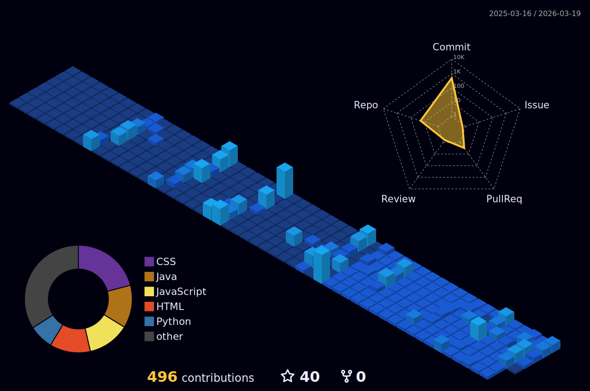

<h1 align="center">Hi! I'm Johan Monsalve</h1>

Software Developer

<h4 align="center">

</h4>

 

  

>[!NOTE]
>**I'm open to receiving offers for jobs**.

<h3 align="left">Connect with me:</h3>

  
  &emsp;
  
  &emsp;
  

  <a href="https://mail.google.com/mail/u/0/?fs=1&tf=cm&to=johanbadillomj@gmail.com&su=Hi,+dear+Johan.&body=I+want+to+contact+you+to…"><i><tt><b>johanbadillomj@gmail.com</b></i></tt></a>

 <b><code>+57 301 886 8235</code></b></a>

>[!IMPORTANT]
>You can contact me more easily by _WhatsApp_.

<h3 align="left">Skills:</h3>
<table align="center" cellpadding="10">  
    <tr>  
      <th align="left">🌐 Front-End</th>  
      <td align="center">  
          
          
         
      </td>  
    </tr>  
    <tr>  
      <th align="left">💻 Back-End</th>  
      <td align="center">  
          
          
                  
      </td>  
    </tr>  
    <tr>  
      <th align="left">💾 Databases</th>  
      <td align="center">  
          
          
      </td>  
    </tr>  
    <tr>  
      <th align="left">🎨 UI/UX & Design</th>  
      <td align="center">  
          
      </td>  
    </tr>  
  </table>  

 

 

    

 

  

  

